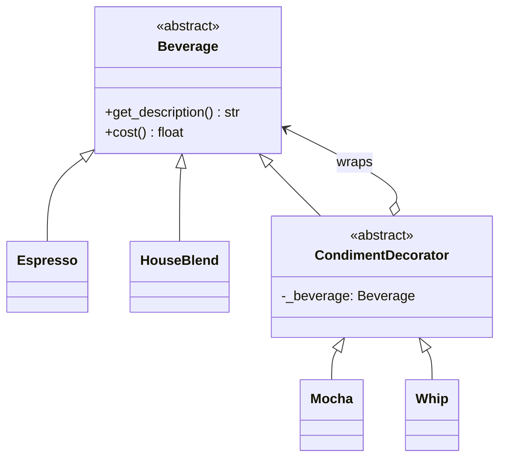

# 装饰器模式（Decorator）示例：Beverage Condiments（Python）

> 对应示例文件：`beverage_decorator.py`

## 1. 模式原理

### 1.1 意图（Intent）
在不修改原有类的前提下，动态地为对象附加额外职责。相较于继承，Decorator 通过对象组合获得更灵活的功能叠加。

一句话：**把“功能扩展”做成可叠加的包装层。**

### 1.2 适用场景
当你满足以下任一情况时，适合使用装饰器模式：

- 需要在运行时按需组合多个功能（而不是预先写死子类组合）。
- 用继承会导致子类爆炸（如“加摩卡+加奶泡+双倍摩卡...”）。
- 希望对单个对象进行扩展，而不是影响整类对象。

### 1.3 关键参与者
- **Component（抽象组件）**：`Beverage`
- **ConcreteComponent（具体组件）**：`Espresso`、`HouseBlend`
- **Decorator（抽象装饰）**：`CondimentDecorator`
- **ConcreteDecorator（具体装饰）**：`Mocha`、`Whip`

### 1.4 与教材 / GoF 描述对照
- GoF 关注点：Decorator 与 Component 继承同一抽象类型，并在内部持有一个 Component 引用，实现行为增强。
- 本示例中：
  - `CondimentDecorator` 继承 `Beverage`，并持有 `self._beverage`；
  - `Mocha` / `Whip` 在调用被包装对象方法的基础上追加描述与价格；
  - 客户端可链式包装：`HouseBlend -> Mocha -> Mocha -> Whip`。

### 1.5 Mermaid 简易类图



---

## 2. 示例故事与代码映射

### 2.1 示例故事
咖啡店有基础饮料（Espresso、House Blend），顾客可在下单时动态加调料（Mocha、Whip）。每增加一种调料，价格与描述都会叠加。

### 2.2 一一对应关系

| 业务概念 | 代码元素 | 说明 |
|---|---|---|
| 基础饮料接口 | `Beverage` | 统一定义 `get_description()` 与 `cost()` |
| 基础饮料实现 | `Espresso`、`HouseBlend` | 提供起始描述和起始价格 |
| 调料包装器 | `CondimentDecorator` | 持有被包装 `Beverage` |
| 调料实现 | `Mocha`、`Whip` | 在原对象基础上叠加描述与费用 |
| 客户端组装 | `main()` | 演示链式包装与最终价格 |

### 2.3 运行时调用主线
1. 创建基础对象，例如 `HouseBlend()`。
2. 依次包装：`Mocha(beverage)`、再 `Mocha(...)`、再 `Whip(...)`。
3. 调用 `get_description()` 与 `cost()` 时，逐层委托并叠加。
4. 得到最终组合结果。

---

## 3. 运行说明

### 3.1 目录结构

```text
python-decorator/
└─ beverage_decorator.py
```

### 3.2 依赖与版本
- **Python**：建议 `3.10+`
- **第三方库**：无（仅标准库 `abc`）
- **JDK**：N/A（本仓库为 Python 示例）

### 3.3 运行命令
在 `python-decorator/` 目录下执行：

```bash
python3 beverage_decorator.py
```

Windows（若 `python3` 不可用）可使用：

```bash
python beverage_decorator.py
```

### 3.4 预期输出（示例）

```text
Espresso $1.99
House Blend Coffee, Mocha, Mocha, Whip $1.39
```

---

## 4. 运行截图 + 图注


